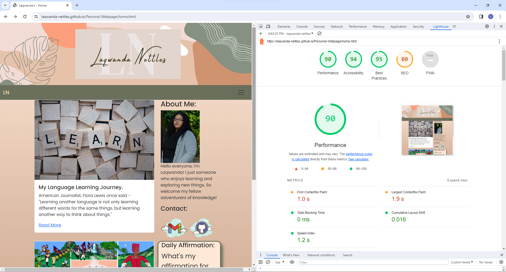
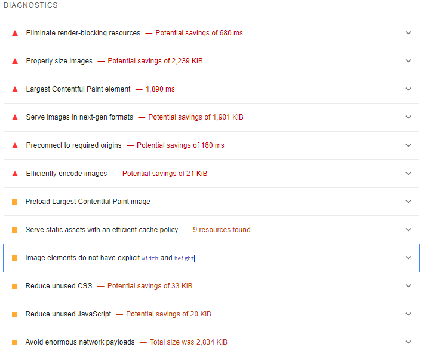
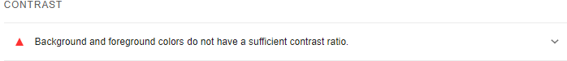
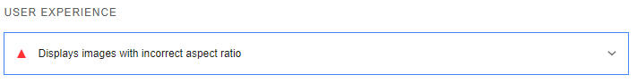
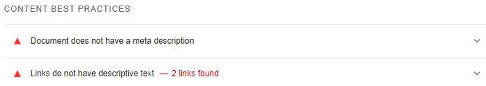
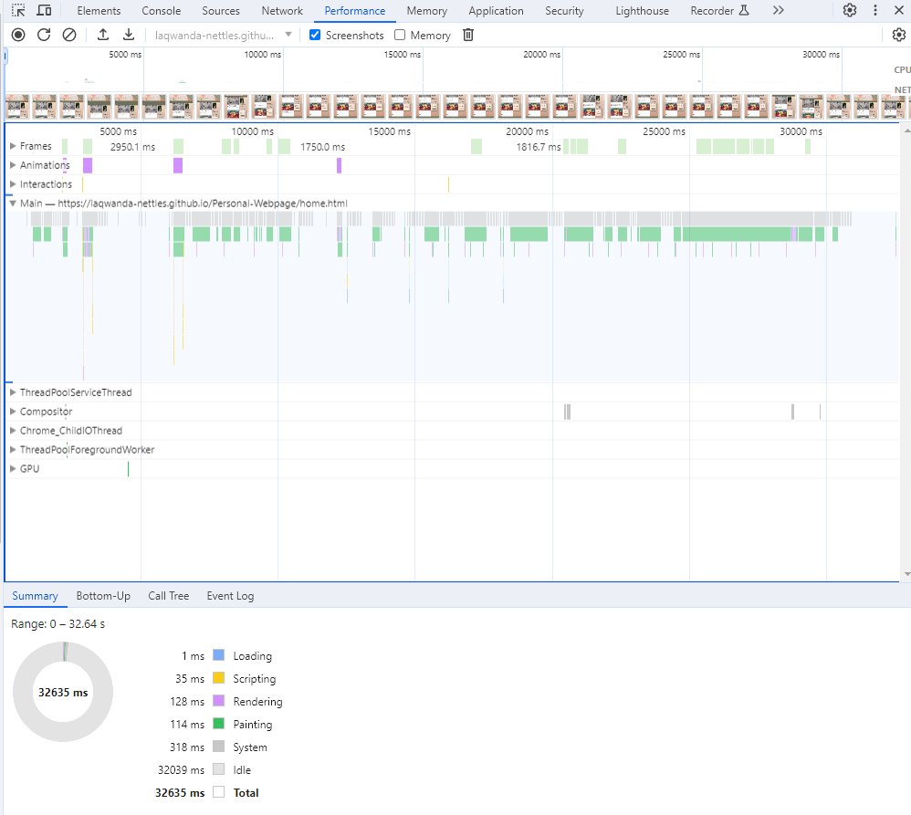
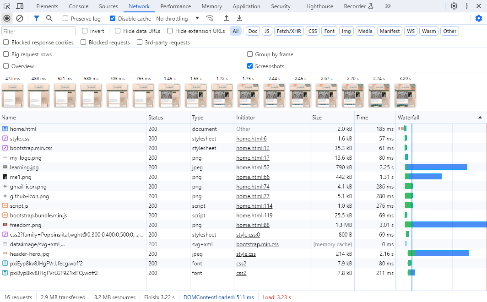

# Web Performance Optimization Assignment

## Lighthouse Audit

### Performance - 90

The performance diagnostics was mostly effected due the images chosen and their sizes, unused css and javascript from bootstrap, using network payloads like google fonts.

### Accessability - 94

Changing the background color and text color for the nav, footer and buttons to have better contrast values.

### Best Practices - 95

Logo image inside of the header used different measurement units px and vh. I'm not really sure if that is what causing the problem.

### SEO - 80

Adding a meta description to summarize what the page is about. My link thoughts, I guess was too vague changing it to something more generic like posts/blog can help users and search engines to understand what my content is about.

## Performance Profiling and Network Analysis

### Performance Profiling

### Network Analysis

Images effected the timing mostly - waiting for server response and content download. Most of my load time is due to my images when using the network tab's big row request, I was able to see that my images were not compressed. Optimizing my Images by using an image CDN or creating multiple sizes - use srcset may help.

## Summary

I found the Lighthouse and Network tabs to be very useful. The performance tab was a bit more challenging for me to understand fully. They all pointed out aspects that I didn't realize contribute to the way a website is experienced. Paying attention to how different elements can affect an user experience, like choosing the right color contrast, images causing slower load times, and using meta descriptions to help users and search engines find and understand your page.
